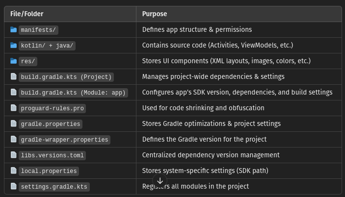
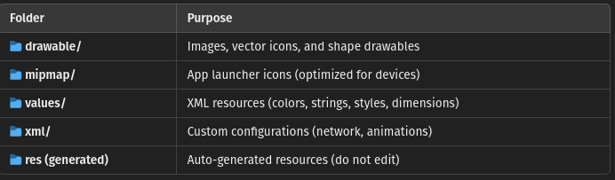
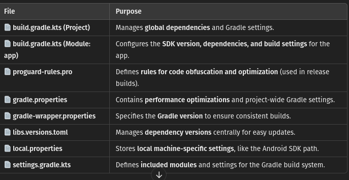

### Setting Up Android Studio

    - Download and install Android Studio you already have it Open Android Studio → Select New Project.
    Choose a template (e.g., Empty Activity).
    Select Kotlin as the language.
    Click Finish and wait for Gradle to build.

### About Project Structure (Gradle)

### Inside Res (Main Resource Folder)
 

### Inside Gradle Scripts (Bild System)
